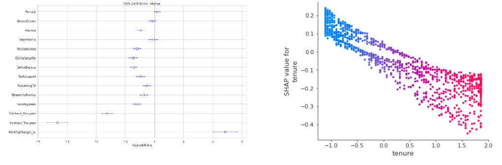

# Analyze and Predict Customer Churn

#### -- Project Status: [Completed]

## Project Intro/Objective
The prpose of this group project is to use logistic regression and survival analysis to examine key features that impact the churn of telecom customers. 

### Team Members
* Alexander Tsibizov
* Avinash Chekuru
* Ella Cucui
* Joana Duarte
* Ling Yee Khor

### Methods Used
* Logistic Regression
* Random Forest
* Machine Learning
* Survival Analysis
* Cox Hazard Model

### Technologies
* Python
* Pandas
* Scikit-learn
* PyCaret
* SHAP (SHapley Additive exPlanations) 
* Lifelines

## Project Description
The group project analyzes the dataset of customer churn in the telecom industry, which contains multiple customer features, such as gender, whether the customer has dependents, type of service, type of contract, payment, and churn. Results include convenience such as automatic payment reduces churn by 45%; customers with multiple phone lines are less likely to churn by 45%; and in terms of services provided, all the following help to reduce churn but at various degrees. Most important are online security and backup features which reduce churn by 52%, while entertainment features such as streaming TV and movies reduce churn by around 30%.
